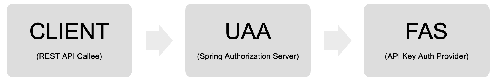

# Assessment Test for Senior Java developer

## Requirements

1.	Create 3 microservices based on Gradle:
2.	Spring Authorization Server which will act as a UAA server
3.	Federated authorization server FAS (apikey-auth-provider) is placed behind UAA server and receives API requests from UAA Server.
4.	Test endpoint (Resource Server)
5.	Upload in GitHub ready code for a review.

## Workflow

1. Rest client makes an API call to the UAA server.
2. UAA server makes a call to FAS (apikey-auth-provider). 
3. Internal token is issued and returned back to UAA.
4. Internal token is returned back to Rest client.

## Diagram

## Demo

Step 0: Gradle and java must be installed.

Step 1: Open a terminal and run the authorization server first with `gradle bootRun` because the resource server contacts it during startup to obtain the public key used to verify JWT signatures.

Step 2: Open two more seperate terminals with `gradle bootRun` from the remaining folders. 

Step 3: Open Chrome and navigate to http://localhost:8080/client/. The client app uses a RestTemplate to request a protected resource from http://localhost:8082/api/. Upon discovering it lacks authorization, it automatically redirects to the /oauth/authorize endpoint to initiate an authorization code flow, authenticating itself as a ‘confidential’ client.

Step 4: The authorization server then redirects to its login page. You can log in using one of these username/password combinations:

user:password (USER role)
admin:password (ADMIN and USER role)

After logging in successfully, you are redirected to the /oauth/confirm_access endpoint to approve the requested grants.

The authorization server then redirects back to the client app at a pre-approved URI with an authorization code.

The client then contacts the authorization server at the /oauth/token endpoint to exchange the authorization code for an access token (and a refresh token).

The client retries the request to the resource server. The resource server validates the JWT token and verifies its signature using the authorization server’s public key. No direct communication between the resource server and the authorization server is needed, which is a benefit of using JWT. The JWT token also includes the user’s roles, which are checked against the resource’s authorization requirements.

Finally, the client receives the resource (a JSON representation of the user principal) and displays it in the browser, where you can also view the JSON Web Token.

Roger Fleenor
Senior Software Engineer

LinkedIn https://www.linkedin.com/in/rogerfleenor/
GitHub https://github.com/rogerfleenor

